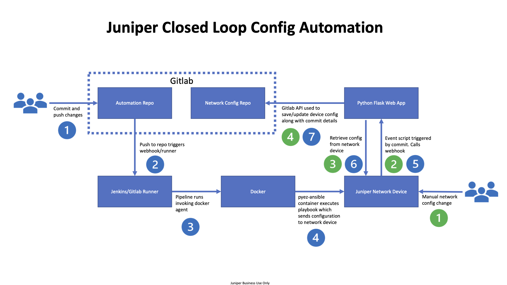
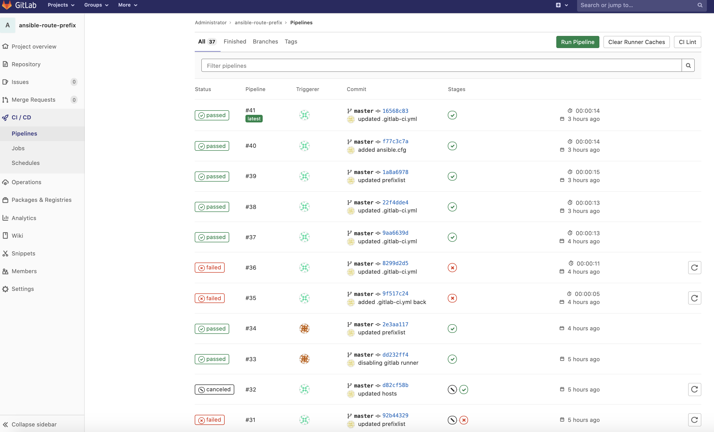
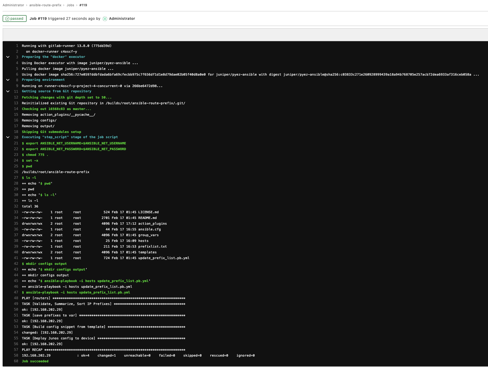
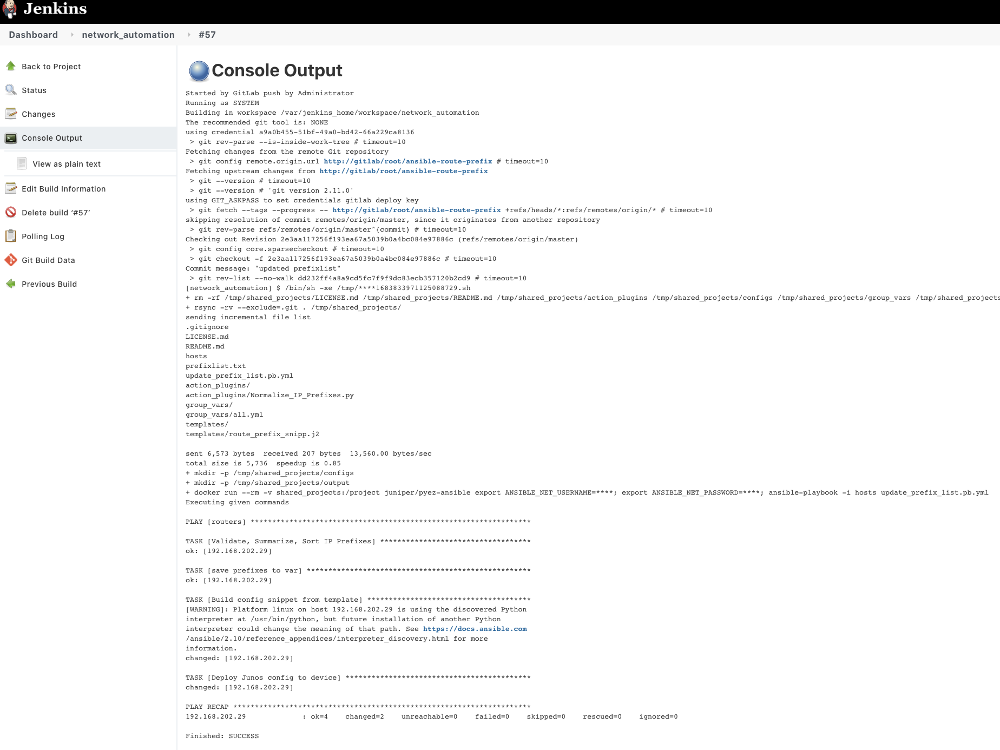
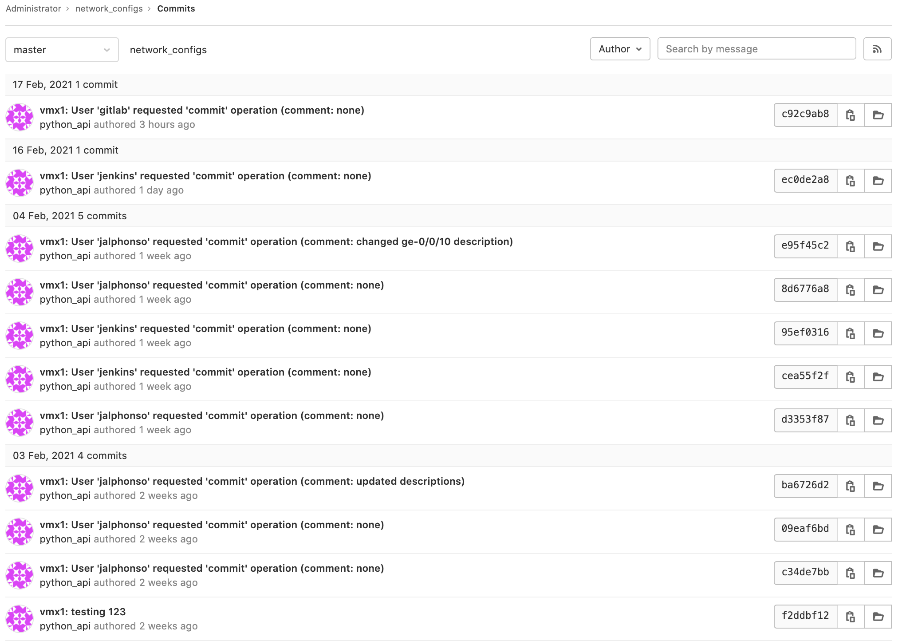
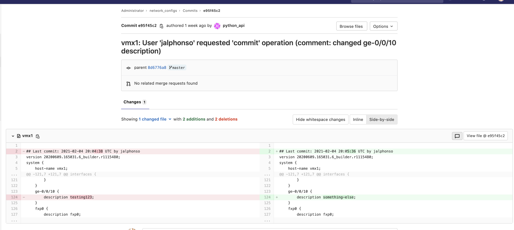

# Juniper Closed Loop Config Automation

This project demonstrates how to integrate DevOps tools to complete life cycle management of network device configurations.

Below is a flowchart describing the workflows.



## Pull Juniper PyEZ Ansible Container Image

```
docker pull juniper/pyez-ansible
```

## Build Flask Docker Image

```
mkdir build
cp Dockerfile build
cp requirements.txt build
cd build
docker build -t flask . # use desired image:tag
```

## Run the containers
NGINX

Note: Obtain/Generate Certs and place them in nginx/certs dir
```
docker run -d -p 8443:443 --name nginx -v /home/ubuntu/nginx/content:/usr/share/nginx/html:ro -v /home/ubuntu/nginx/certs:/etc/nginx/certs:ro -v /home/ubuntu/nginx/conf/nginx.conf:/etc/nginx/conf.d/nginx.conf:ro -d nginx
```

FLASK
```
docker run --name flask -it --rm -p 5000:5000 -v $PWD:/app flask
```

GITLAB
```
docker run --network config -d --hostname gitlab --publish 443:443 --publish 80:80 --publish 2222:22 --name gitlab --restart always --volume "$PWD/gitlab/srv/config":/etc/gitlab --volume "$PWD/gitlab/srv/logs":/var/log/gitlab --volume "$PWD/gitlab/srv/data":/var/opt/gitlab gitlab/gitlab-ce:latest
```

JENKINS
```
docker run --network config --name jenkins -d -u 0 --privileged -v /var/run/docker.sock:/var/run/docker.sock -v $(which docker):/usr/bin/docker -v jenkins_home:/var/jenkins_home -p 8080:8080 -p 50000:50000 jenkins/jenkins:lts
```

GITLAB RUNNER
```
docker run --network config -d --name gitlab-runner --restart always -v /var/run/docker.sock:/var/run/docker.sock -v "$PWD/gitlab/srv/runner":/etc/gitlab-runner gitlab/gitlab-runner:latest
```
And register the runner
```
docker exec -it gitlab-runner gitlab-runner register \
  --non-interactive \
  --executor "docker" \
  --docker-network-mode config \
  --docker-image alpine:latest \
  --url "http://gitlab/" \
  --registration-token "TOKEN" \
  --description "docker-runner" \
  --tag-list "docker,ansible" \
  --locked="false" \
  --access-level="not_protected"
```

## Configure secrets
```
cp example-secrets.txt secrets.py
```
Update values accordingly

## Configure Webhook or Runner
If using Jenkins configure a webhook. There are several plugins required to complete the integraiton between Jenkins and Gitlab and Jenkins and Docker and are outside the scope of this document.

If using Gitlab Runner, deploy and register the container if you haven't already. Also in the variable section create vars for ANSIBLE_NET_USERNAME and ANSIBLE_NET_PASSWORD. Finally copy the .gitlab-ci.yml to your automation repo.

```
cp automation-repo.gitlab-ci.yml automation-repo/.gitlab-ci.yml
```

## Configure Junos Event Script

```
event-options{
    policy on-commit {
        events ui_commit_completed;
        within 90 events ui_commit;
        then {
            event-script trigger_backup.py {
                arguments {
                    token some-token;
                    url https://app-server:8443/backup;
                }
            }
        }
    }
    event-script {
        file trigger_backup.py;
    }
}
```

## Example CI/CD
GITLAB




JENKINS


## Gitlab Configuration Repo



